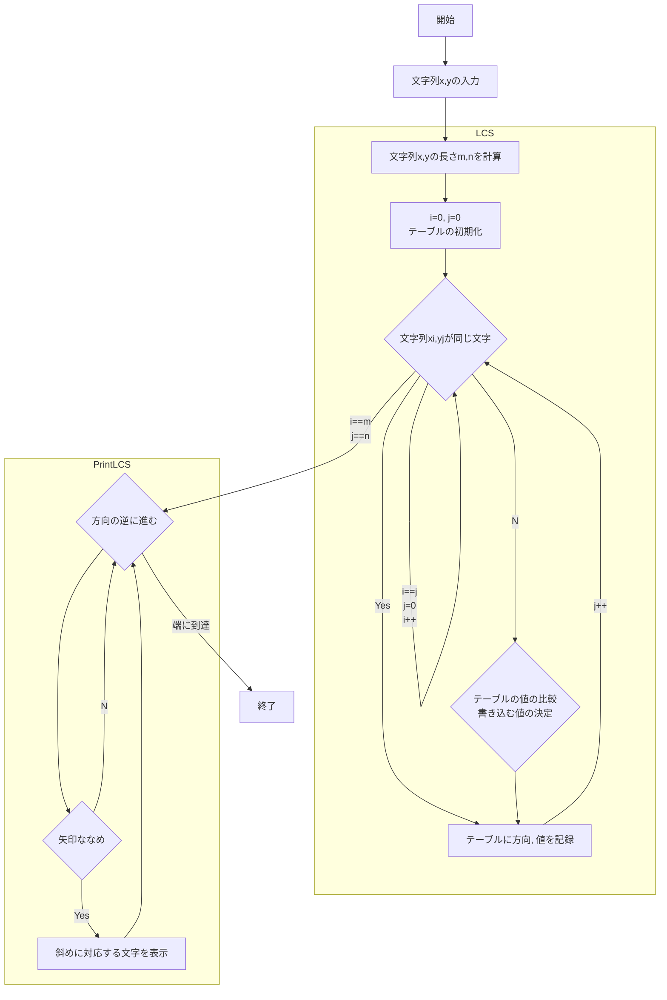

## 最長共通部分配列問題

```mermaid
graph TD
S[開始]-->A
A[文字列x,yの入力]-->B[文字列x,yの長さm,nを計算]
subgraph LCS
B-->C[i=0, j=0\nテーブルの初期化]
C-->D{文字列xi,yjが同じ文字}
D--No-->E{テーブルの値の比較\n書き込む値の決定}
D--Yes-->F
E-->F[テーブルに方向, 値を記録]
F--j++-->D
D--i==j\nj=0\ni++-->D
end
subgraph PrintLCS
D--i==m\nj==n-->G{方向の逆に進む}
G-->H{矢印ななめ}
H--Yes-->J[斜めに対応する文字を表示]
H--No-->G
J---->G
end
G--端に到達-->K[終了]

```
