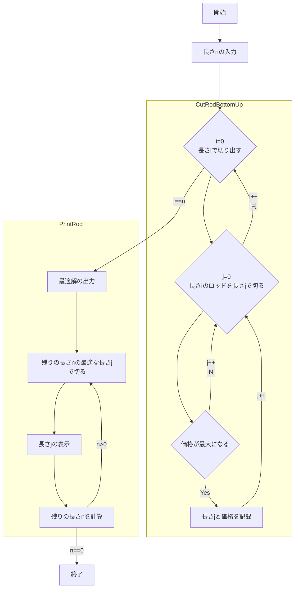

## ロッド切り出し問題

```mermaid
flowchart TD

S[開始]-->A
A[長さnの入力]--->B{i=0\n長さiで切り出す}
subgraph CutRodBottomUp
B-->C{j=0\n長さiのロッドを長さjで切る}
C-->D{価格が最大になる}
D--Yes-->E[長さjと価格を記録]
D--j++\nNo-->C
E--j++-->C
C--i++\ni=j-->B
end
subgraph PrintRod
B--i==n--> G[最適解の出力]
G-->H[残りの長さnの最適な長さjで切る]
H-->I[長さjの表示]
I-->J[残りの長さnを計算]
J--n>0-->H
end
J--n==0-->k[終了]

```
