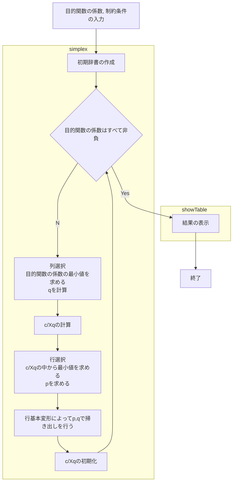

## ラーメン屋問題

```mermaid
graph TD

A[目的関数の係数, 制約条件の入力]-->B
subgraph simplex
B[初期辞書の作成]-->C{目的関数の係数はすべて非負}
C--No-->D[列選択\n目的関数の係数の最小値を求める\nqを計算]

D-->E[c/Xqの計算]
E-->F[行選択\nc/Xqの中から最小値を求める\npを求める]
F-->G[行基本変形によってp,qで掃き出しを行う]
G-->H[c/Xqの初期化]
H-->C
end
subgraph showTable\nshowResult
C--Yes-->L[結果の表示]
end
L-->K[終了]
```
