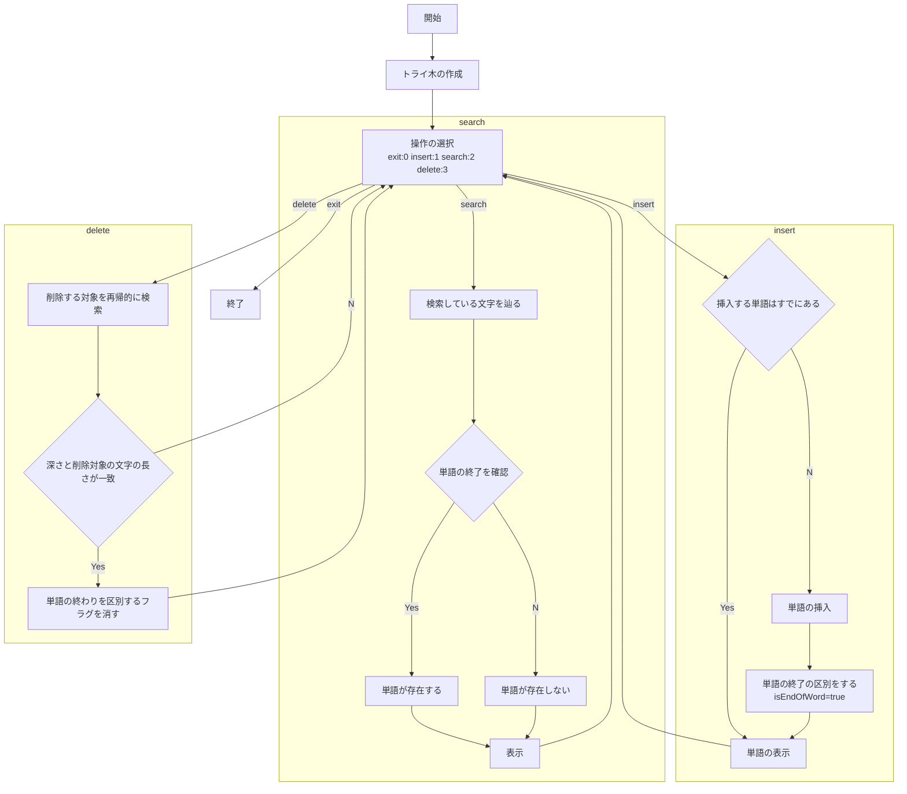

## トライ木

```mermaid
graph TD
A[開始]-->A0[トライ木の作成]
A0-->B

B--search-->S
B--delete-->D


I2-->B

B[操作の選択\nexit:0 insert:1 search:2 delete:3]

--insert-->I
subgraph insert
I{挿入する単語はすでにある}--No-->I0[単語の挿入]-->I1
I--Yes-->I2
I1[単語の終了の区別をする\nisEndOfWord=true]
I1-->I2[単語の表示]
end

subgraph search
S[検索している文字を辿る]-->S1{単語の終了を確認}
S1--Yes-->SY[単語が存在する]
S1--No-->SN[単語が存在しない]
SY-->S2[表示]
SN-->S2
S2-->B
end

subgraph delete
D[削除する対象を再帰的に検索]-->D1{深さと削除対象の文字の長さが一致}
D1--Yes-->DY[単語の終わりを区別するフラグを消す]-->B
D1--No-->B
end

B--exit-->X[終了]


```
