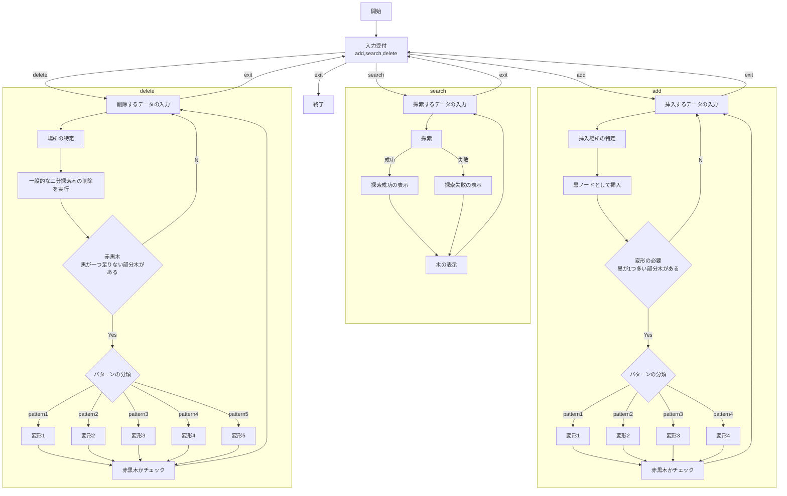

```mermaid
graph TD
A[開始]-->B[入力受付\nadd,search,delete]
B--exit-->X[終了]
B--add-->C0[挿入するデータの入力]
B--search-->D
B--delete-->E[削除するデータの入力]
C0--exit-->B
D--exit-->B
E--exit-->B

subgraph add
C0-->C1[挿入場所の特定]-->C2
C2[黒ノードとして挿入]-->C3
C3{変形の必要\n黒が1つ多い部分木がある}
C3--Yes-->C4{パターンの分類}
C3--No-->C0
C4--pattern1-->CP1[変形1]-->CE
C4--pattern2-->CP2[変形2]-->CE
C4--pattern3-->CP3[変形3]-->CE
C4--pattern4-->CP4[変形4]-->CE
CE[赤黒木かチェック]-->C0
end

subgraph search
D[探索するデータの入力]-->D1[探索]
D1--成功-->DN[探索成功の表示]-->D2[木の表示]
D1--失敗-->DY[探索失敗の表示]-->D2
D2-->D
end

subgraph delete
E-->E1[場所の特定]
E1-->E2[一般的な二分探索木の削除を実行]
E2-->E3{赤黒木\n黒が一つ足りない部分木がある}
E3--Yes-->E4{パターンの分類}
E3--No-->E
E4--pattern1-->EP1[変形1]-->E5
E4--pattern2-->EP2[変形2]-->E5
E4--pattern3-->EP3[変形3]-->E5
E4--pattern4-->EP4[変形4]-->E5
E4--pattern5-->EP5[変形5]-->E5
E5[赤黒木かチェック]-->E
end


```
